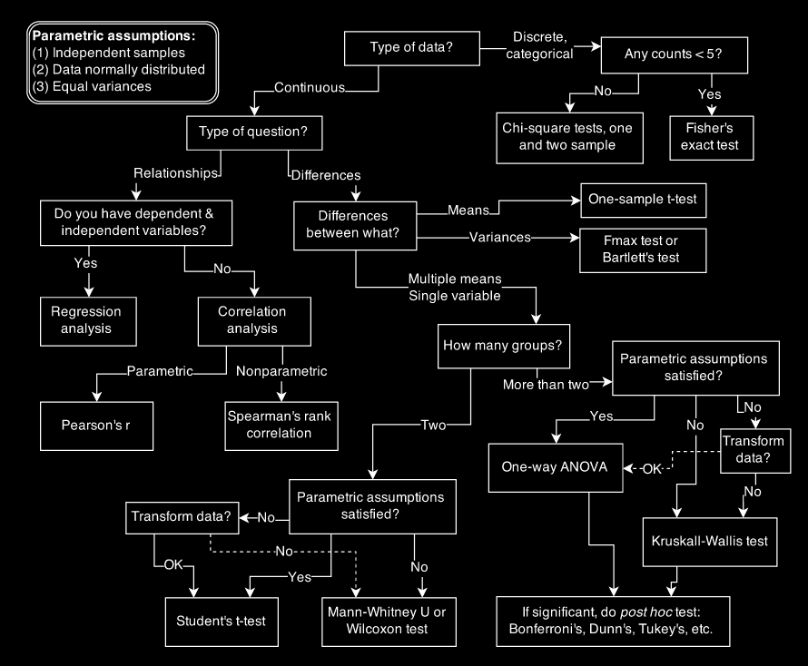
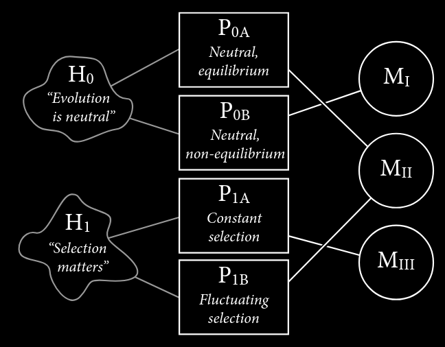

Statistical Rethinking

Chapter 1

### 1.1 The Golem of Prague

The author begins with an illustration of a 'golem', a creature with incredible intellectual power to accomplish the tasks presented to them. However, they lack the wisdom to understand the context and implications of its knowledge, which according to legend has proven fatal.

Classical statistics presents us with a broad range of golems, or tools. However, for as much power as they have, they lack wisdom. A statistical framework "doesn't discern when the context is inappropriate for its answers. It just knows its own procedure, nothing else." (2)

Statistics is "neither mathematics nor a science, but rather a branch of engineering. And like engineering, a common set of design principles and constraints produces a great diversity of specialized applications."

New statistic students are offered a "zoo of pre-constructed golems known as 'tests.' Each test has a particular purpose. Decision trees, like the one (see below), are common. By answering a series of sequential questions, users choose the 'correct procedure' for their research circumstances." (3)

*A typical statistical decision tree to chose the appropriate model, there are dozens of such decision trees*

"Unfortunately, while experienced statisticians grasp the unity of these procedures, students and researchers rarely do" (3).

Is there any wonder scientific progress is halted: even amongst the educated practitioners and researchers exist a narrow restriction on the statistical tools that validate and contribute to the body of accepted knowledge. I suspect the 'replication crisis' is only a symptom of the larger difficulty with orthodox statistics and friction practitioners, laypeople, and researchers of all levels feel.

Could Bayesian inference, plausible reasoning, and data driven model development be a solution?

"For some, the toolbox of pre-manufactured golems is all they will ever need. Provided they stay within well-tested contexts, using only a few different procedures in appropriate tasks, a lot of good science can be completed...Serious trouble begins when scholars move on to conducting innovative research, pushing the boundaries of their specialties." (3)

Why?

"The classical procedures of introductory statistics tend to be inflexible and fragile"

inflexible: "they have limited ways to adapt to unique research contexts"

fragile: "they fail in predictable ways when applied to new contexts"

"at the boundaries of most sciences it is hardly ever clear which procedure is appropriate"

- e.g. Fisher's exact test, applies to a narrow empirical context, but is used regularly whenever cell counts are small, with hundreds of uses of Fisher's exact test in scientific journals, all of which are inappropriate uses

even linear regression, which is quite flexible and able to encode a large diversity of interesting hypotheses, is sometimes fragile

- e.g. if there is substantial measurement error on prediction variables, then the procedure can fail
- moreover, its nearly always possible to do better than ordinary linear regression, because of over-fitting (clarify)

in short, "classical tools are not diverse enough to handle many common research questions"

"every active area of science contends with unique difficulties of measurement and interpretation,, converses with idiosyncratic theories in a dialect barely understood by other scientists from other tribes. statistical experts outside the discipline can help, but they are limited by lack of fluency in the empirical and theoretical concerns of the discipline." (3)

moreover, statistical tools don't understand cause and effect, they only understand association (3-4)

This text aims to move towards a 'unified theory of golem engineering, as et of principles for designing, building, and refining special-purpose statistical procedures. Every major branch of statistical philosophy possesses such a unified theory. But the theory is never taught in introductory -- and often not even in advanced-- courses. So there are benefits in rethinking statistical inference as a set of strategies, instead of a set of pre-made tools.' (4)

### 1.2 Statistical Rethinking

CLARIFY WHAT IS A HYPOTHESIS
CLARIFY WHAT IS A MODEL
CLARIFY WHAT IS FALSIBILITY

A lot can go wrong with statistical inference, this is one reason beginners can be so anxious about it.

Let that anxiety become wisdom as we work with inner mechanics of each golem.

"If you don't understand how the golem processes information, then you can't interpret the golem's output. This requires knowing the model in greater detail than is customary, and it requires doing the computations the hard way, at least until you are wise enough to use the push-button solutions." (4)

There are conceptual difficulties, as well, concerning how scholars define statistical objectives and interpret results. To overcome these hurdles, we need to appreciate how statistical models relate to hypotheses and the phenomena being modeled.

A common misconception among students and researchers is "the proper objective of statistical inference is to test null hypotheses." This objective seems to resonate with Karl Popper's argument of science advancing by falsifying hypotheses. Karl Popper is arguably the most influential philosopher of science (among scientists, at least). Falsifying hypotheses seems to be the statistical approach to advancing science.

Unfortunately, this belief is a kind of 'folk Popperism.' Popper recognized that science is not *described* by the falsification standard. Deductive falsification is impossible in nearly every scientific context. Here we consider two reasons for this impossibility.

1. Hypotheses are not models The relations between hypotheses and different kinds of models are complex. Many models often correspond to one hypothesis, and many hypothesis can correspond to a single model. This makes strict falsification impossible.
2. Measurement matters. Even if WE consider the data to falsify a model, another observer will debate our methods and measures. They may not trust the data. Sometimes they're right.

The scientific method cannot be reduced to a statistical procedure, and so our statistical methods should not pretend. If you are convinced science often does work, "then learning it doesn't work via falsification shouldn't change your mind. But it might help you do better science" (4-5)

Null hypothesis statistical testing falsifies null hypotheses NOT the actual research hypothesis. In effect, this is a reversal of Karl Popper's proposed falsification.

#### 1.2.1 Hypotheses are not models

[TODO]

#### 1.2.1 Observation Error

TODO

#### 1.2.2.2 Continuous hypotheses

TODO

TODO THIS SECTION SHOULD BE ITS OWN APPENDIX, GOOD TO KNOW BUT NOT NEED TO HAVE (or is it?)

### 1.3 Tools for Golem Engineering

What are we to do if mimicking falsfiication is not a good approach to statistical methods?

We can still model. "Models can be made into testing procedures-- all statistical tests are also models-- but they can also be used to design, forecast, and argue. Doing research benefits from the ability to produce and manipulate models, both because scientific problems are more general than 'tessting' and because the pre-made golems you maybe met in introductory statistics courses are ill-fit to many research contexts.

In terms of evaluating your model, understanding when its going wrong, and how to build a better model in its place, 'without engineering training, you're always at someone's mercy."

We want to use our models for several purposes: designing inquiry, extracting information from data, and making predictions. This book coveers tools to help with each purpose:

1. Bayesian data analysis
2. Model comparison
3. Multilevel models
4. Graphical causal models

These tools are deeply related, so it's best to teach/learn them together. You learn them by implementing them. "You can comprehend golem engineering until you do it." (10) so this book focuses mostly on coding.

#### 1.3.1 Bayesian Data Analysis

One of the most effective and general approaches to using some data to learn about the world.

A modest definition of Bayesian data analysis: counting the number of ways the data could happen, according to our assumptions. Things that can happen more ways are more plausible.

Probability theory comes into play here. Probability theory is just calculus for counting.

"This allows us to use probability theory as a general way to represent plausibility, whether in reference to countable events in the world or rather theoretical constructs like parameters. The rest follows logically. Once we have defined the statistical model, Bayesian data analysis forces a purely logical way of processing the data to produce inference" (10-11) 

- This is explored more in chapter 2

Bayesian probability is general and even includes as a special case the 'frequentist' approach

- frequentist: requires that all probabilities be defined by connection to the frequencies of events in very large samples
  - this leads to frequentist notion of uncertainty to be premised on imaginary resampling of data: if we were to repeat the measurement many many times, we would end up collecting a list of values that will have some pattern to it
  - it means parameters and models cannot have probability distributions, only measurements can (*the achilles heel of the approach, in my opinion*)
  - the distribution of these measurements is called a sampling distribution
  - this resampling is never done, and in general it doesn't even make sense
    - its absurd to consider repeat sampling of the diversification of song birds in the Andes
  - but in many contexts, like controlled greenhouse experiments, its a useful device for describing uncertainty
  - this assumption about what the data would look like under resampling is just part of the model
  - its a leap of faith just as 'fantastical' as the Bayesian use of probability to describe all types of uncertainty, whether empirical or epistemological

These different approaches to proabbility do enforce different trade-offs

- example of Galileo's blurry telescope looking at Saturn
  - the frequentist would be at a loss, saying resample a thousand times in the same blurry lens
  - the bayesian would be able to model the deterministic 'noise' behind the blurry image using probability
  - this means it isn't always useful to identify probability with frequency
    - the field of image reconstruction and processing is dominated by Bayesian algorithms
      - (bayesian search missions in the ocean, as well)
- some routine statistical procedures like linear regression, the difference in the conceptual baggage of each framework, Bayesian or Frequentist, have less of an effect
  - however the Bayesian tools don't justify their inferences with an imagined repeat sampling
  - said in another way: Bayesian tools treat 'randomness' as a property of information, not of the world, with the presumption that if we had more information, we could exactly predict everything
  - randomness is just being used to describe our uncertainty in the face of incomplete knowledge
  - from the probability model's perspective, the coin toss is 'random' but its really the model thats random, not the coin
- however no statistical framework or model is complete in capturing rational decision making
  - author mentions a critque of 'Bayesianism', by Binmore, which appears to be a more dogmatic insistence on applying bayesian modeling to 'large world contexts'
    - i'm left wondering how this contends with the 'limited information' at the present statement just above, as well as the laplace-jeffreys-cox-jaynes lineage the author claims

one more advantage of bayesian statistics is people generally find it more intuitve

- many scientists interpret non-Bayesian results in Bayesian terms, mistakenly
  - e.g. interpreting ordinary p-values as Bayesian posterior probabilities
  - e.g. non-Bayesian confidence intervals as Bayesian ones
  - the correct understandings of these will be offered later
  - the opposite mistake--interpreting a posterior probability as a p-value--seems to happen only rarely !
- this doesnt ensure Bayesian analysis will be more correct, but scientists intuitions will less commonly be at odds with the actual logic of the framework, simplifying teaching statistical modeling
- how can multiple theories of probability coexist if its a mathematical field
  - this video on the sociology of pure mathematics seems relevant [link](https://www.youtube.com/watch?v=UZah3BqsU8w)

bayesian statistical theory is much older than the typical tools of intro stat, as well, and is recently resurging due to its effectiveness and increase in computational power

#### 1.3.2 Model Comparison and prediction

Bayesian data analysis allows for models to learn from data, how to chose among the many available models?

prefer the ones that make good predictions

how to do this without knowing the future?

two tools to study, that compare models based upon expected predictive accuracy:

- cross validation
- information criteria

comparing models by predictive accuracy can be useful in itself, 

- unveils an amazing fact: complex models often make worse predictions than simpler models
- the paradox of prediction: overfitting
  - the more the model learns from data, the less well it performs as a model
  - more complex models tend towards overfitting than simple ones
  - fitting is easy prediction is hard

cross validation and information criteria provide 

1. useful expectations of predictive accuracy rather than merely fit to sample (comparing models where it matters) -- isn't cross-validation comparing only one model against itself?
2. an estimate of the tendency of a model to overfit, showing how models and data interact, helping us design better models (more in the next section)
3. they help to spot highly influential observations

while bayesian data analysis has been worked on for centuries, information criteria are young and the field is evolving quickly

many staticians haven't used IC in an applied problem, and theres no consensus about which metrics are best and how to best use them

however IC is already in frequent use in sciences, in prominent publications and debates (their power is often exaggerated so we will be careful to understand what they can and cannot do well)

#### Multilevel Models

TODO

#### 1.3.4 Graphical causal models

TODO

#### 1.4 Summary

TODO

