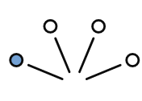
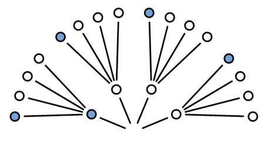
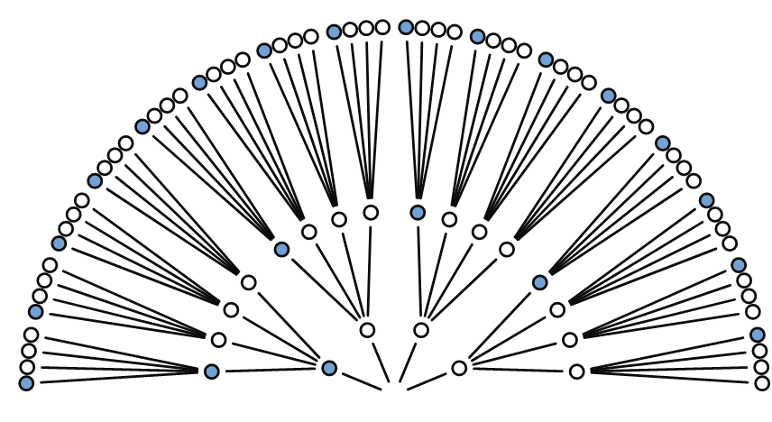
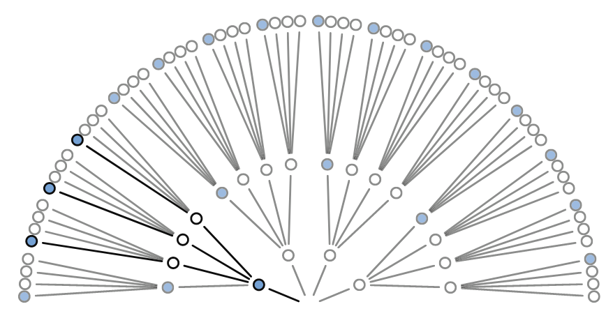
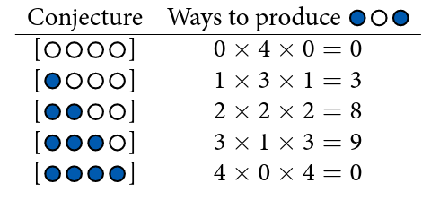
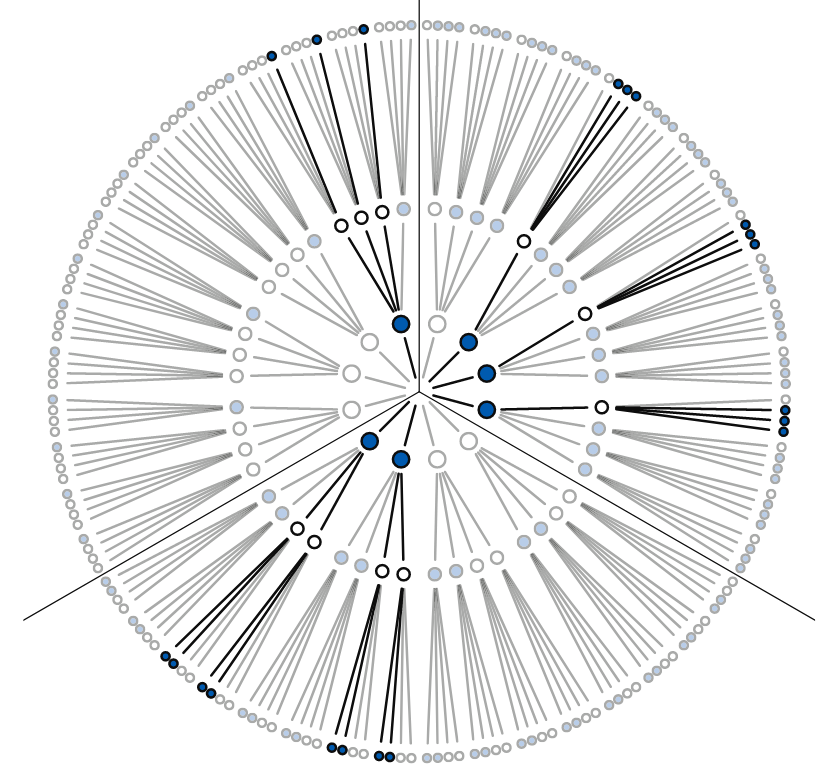
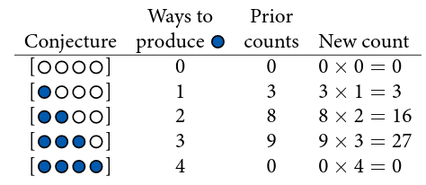
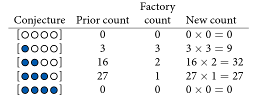

sr_ch2

### 2.1 The Garden of Forking Data

Let's build up Bayesian inference from the ground up, so there's no superstition about it.

Bayesian inference is really just counting and comparing of possibilities.

Bayesian inference explores all paths, wich each decision branching outword into an expanding garden of forking paths.

"In order to make good inference about what actually happened, it helps to consider everything that could have happened." *resonates with Deleuzian/Bergsonian notion of brain selecting the virtual and concepts guiding that process*

"A bayesian analysis is a garden of forking data, in which alternative sequences of events are cultivated. As we learn about what did happen, some of these alternative sequences of events are cultivated. As we learn about what did happen, some of these alternative sequences are pruned. In the end, what remains is only what is logically consistent with our knowledge." (21)

"this approach provides a quantitative ranking of hypotheses, a ranking that is maximally conservative, given the assumptions and data that go into it. The approach cannot guarantee a correct answer, on large world terms. But it can guarantee the best possible answer, on small world terms, that could be derived from the information fed into it."

#### 2.1.1 Counting Possibilities

Illustration with marbles

TODO

Note about original ignorance means uniform prior

#### 2.1.3 From counts to probability

principle of honest ignorance: "when we don't know what caused the data, potential causes that may produce the data in more ways are more plausible"